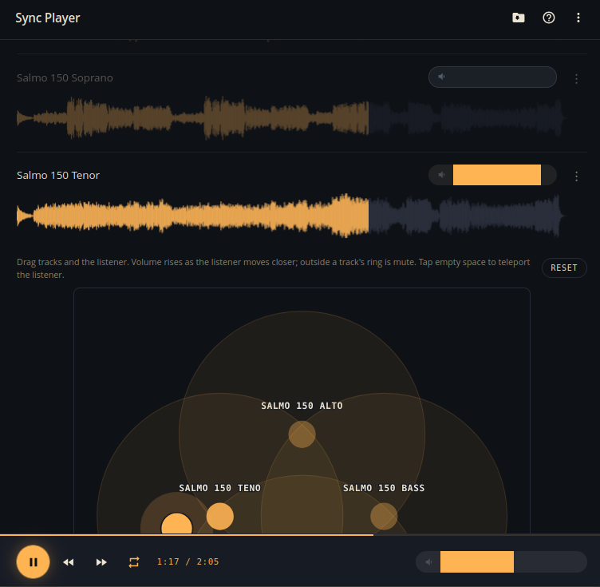

# Sync Player

Web-Audio player that plays every audio file in a folder **at the same time, in sync** — for choir rehearsal stems, multi-mic recordings, alternate mixes, etc. Per-track + master volume, seekable waveforms, browser-side caching, and optional per-folder metadata (description + per-track base tones) stored in `.sync-player.json`.

Two source adapters: **Nextcloud public share** or **local filesystem**. One deployment = one source.

## Run

    php -S localhost:8000

Open <http://localhost:8000/>.

## Configure

Copy `config.example.php` to `config.php` and edit it, or set the matching `SYNCPLAYER_*` environment variables.

- Local adapter: set `'adapter' => 'local'` and `'local.root'`.
- Nextcloud adapter: set `'adapter' => 'nextcloud'`, `'nextcloud.host'`, and `'nextcloud.token'`.
- To save `.sync-player.json` back to a Nextcloud share, also set `'nextcloud.can_write' => true` or `SYNCPLAYER_NC_CAN_WRITE=1`, but only when that public share allows upload/editing.

Password-protected Nextcloud shares prompt on first 401.

## Security Note

For convenience, entered share/app passwords are stored in browser `localStorage`
under adapter-scoped keys (`spw_<adapterId>` and `apw_<adapterId>`). This is
plain text in the browser profile storage, so use only on trusted devices and
browsers.

## Files

- `index.php` — PHP API + adapters + HTML shell
- `app.js` — frontend (sync player, waveform, cache, UI)
- `AGENTS.md` — architecture notes

## Keyboard

`Space` play/pause · `←`/`→` seek 5s (Shift: 10s) · `m` mute · `r` repeat
